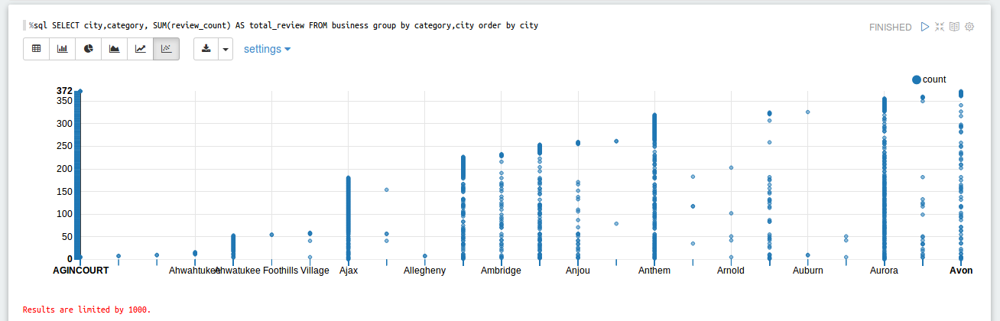
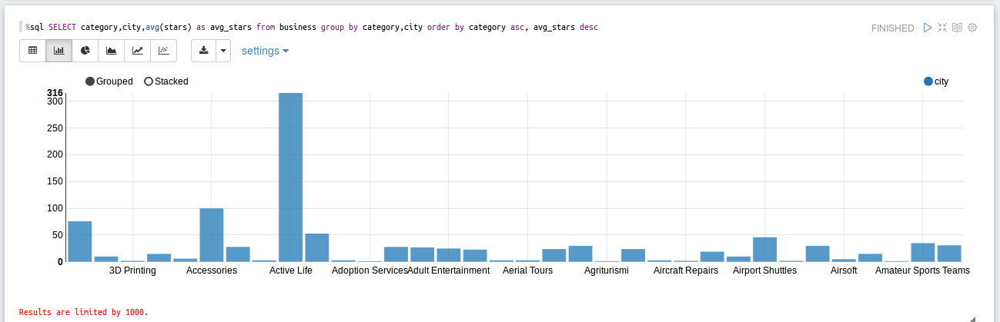
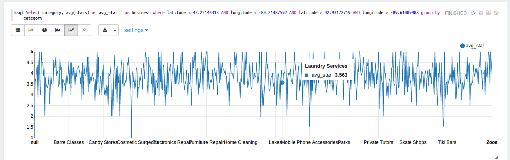
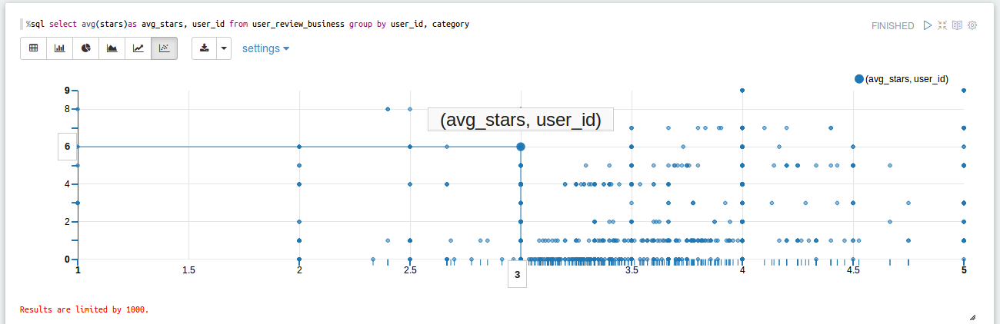

## Big Data Analysis and Visualization
Gathering useful insights from the Dataset using interactive tool **Apache Zeppelin**. This tool provides an integrated platform to have a Web-based notebook that enables data-driven, interactive data analytics and collaborative documents with SQL, Scala etc. 
I am running zeppelin locally on docker by following these [instructions](https://github.com/dylanmei/docker-zeppelin). I pulled all the JSON files into HDFS for easy access.

### About the Yelp Dataset
- 4.1M reviews and 947K tips by 1M users for 144K businesses
- 1.1M business attributes, e.g., hours, parking availability, ambience.
- Aggregated check-ins over time for each of the 125K businesses
- 200,000 pictures from the included businesses

### Analysis on Zeppelin
- Summarize the number of reviews by US city, by business category.
	- To do this, first load “yelp_academic_dataset_business.json” and collect “review_id”, “city” and “categories”. 
	- Flatten the categories from array of strings to multiple strings. 
	- Group the grabbed values by “city” and “categories” and count the number “review_count”. Order it by city only to get # of reviews by US city.
	- Use `%sql` command to generate the visualizations.
	
```scala
import scala.collection.mutable.WrappedArray
import spark.implicits._
import org.apache.spark.sql.functions._

val business = spark.read.json("hdfs://localhost:8020/usr/data/yelp_dataset_challenge_round9/yelp_academic_dataset_business.json")
 
val b = business.withColumn("category", explode(
    when(col("categories").isNotNull, col("categories"))
    .otherwise(array(lit(null).cast("string")))
    ))
    
b.registerTempTable("business")

%sql SELECT city,category, SUM(review_count) AS total_review,FROM business group by category,city order by city

```



- Rank all cities by # of stars descending, for each category
	- To do this, first load “yelp_academic_dataset_business.json” and collect “stars”, “city” and “categories”.
	- Flatten the categories and cast as a string, ignore Null entries.
	- Group the grabbed values by “city” and “categories” and do the average on “stars”.
	- Rank the cities based on average # of stars in each category that were extracted.
	
```scala
import scala.collection.mutable.WrappedArray
import spark.implicits._
import org.apache.spark.sql.functions._

val business = spark.read.json("hdfs://localhost:8020/usr/data/yelp_dataset_challenge_round9/yelp_academic_dataset_business.json")
 
val b = business.withColumn("category", explode(
    when(col("categories").isNotNull, col("categories"))
    .otherwise(array(lit(null).cast("string")))
    ))
    
b.registerTempTable("business")

%sql SELECT  category,city,avg(stars) as avg_stars from business group by category,city order by category asc, avg_stars desc;

```



- What is the average rank (# stars) for businesses within 10 miles of the University of Wisconsin - Madison, by type of business?
	>Center: University of Wisconsin - Madison
	>Latitude: 43 04’ 30” N, Longitude: 89 25’ 2” W
	>Decimal Degrees: Latitude: 43.0766, Longitude: -89.4125
	>The bounding box for this problem is ~10 miles, which we will loosely define as 10 minutes. So the bounding box is a square box, 20 minutes long each side (of longitude and latitude), with UWM at the center.

	- To do this, first load “yelp_academic_dataset_business.json” and collect “stars”, “categories”, “latitude”, “longitude”. For latitude, longitude explicit casting of float and double value was done to bypass the error of Type cast problem. 
	- Flatten the categories, cast it as string, ignore NULL entries.
	- Calculated the 10 miles distance around the university using google distance measure feature and filtered the data for the specified bounds inside the `%sql` command.
	- Grouping was used to collect data for each category and then, average # of stars were generated.
	
```scala
import scala.collection.mutable.WrappedArray
import spark.implicits._
import org.apache.spark.sql.functions._

val business = spark.read.json("hdfs://localhost:8020/usr/data/yelp_dataset_challenge_round9/yelp_academic_dataset_business.json")
 
val b = business.withColumn("category", explode(
    when(col("categories").isNotNull, col("categories"))
    .otherwise(array(lit(null).cast("string")))
    ))
    
b.registerTempTable("business")
%sql Select category, avg(stars) as avg_star from business where latitude < 43.22145313 AND longitude < -89.21487592 AND latitude > 42.93172719 AND longitude > -89.61009908 group by category order by category;

```



- Rank reviewers by number of reviews. For the top 10 reviewers, show their average number of stars, by category.
	- To do this, load “yelp_academic_dataset_business.json”, “yelp_academic_dataset_review.json” and “yelp_academic_dataset_user.json”.
	- Order the user data by decreasing order of # of “review_count” and grab the first 10 values.
	- Join action is used between all the three loaded data to grab the “user_id”, “categories” and “stars” for the top 10 user_id.
	- Finally group the data with “user_id” and “categories” and average of #stars for the grouped values.
	
```scala
import spark.implicits._
import org.apache.spark.sql.functions._

val spark = new org.apache.spark.sql.SQLContext(sc)

val user_data = spark.read.json("hdfs://localhost:8020/usr/data/yelp_dataset_challenge_round9/yelp_academic_dataset_user.json")

val user_attributes = user.select("user_id","name","review_count")

user_attributes.registerTempTable("user");

val user_attributes_sorted = spark.sql("select * from user order by review_count desc");

val top10 = user_attributes_sorted.limit(10);

top10.registerTempTable("top10");

val reviews_data = spark.read.json("hdfs://localhost:8020/usr/data/yelp_dataset_challenge_round9/yelp_academic_dataset_review.json")

val review_attributes = reviews_data.select("user_id","business_id","stars")

review_attributes.registerTempTable("review");

val user_review = spark.sql("select top10.user_id, top10.name, top10.review_count, review.business_id, review.stars from top10 JOIN review on top10.user_id=review.user_id")

user_review.registerTempTable("user_review")

val business_data = spark.read.json("hdfs://localhost:8020/usr/data/yelp_dataset_challenge_round9/yelp_academic_dataset_business.json")

val b = business.withColumn("category", explode(
    when(col("categories").isNotNull, col("categories"))
    .otherwise(array(lit(null).cast("string")))
    ))

val business_attributes = b.select("business_id","category");
business_attributes.registerTempTable("business");

val user_review_business = spark.sql("select user_review.business_id,user_review.name,user_review.stars,business.category from user_review JOIN business on user_review.business_id = business.business_id");

user_review_business.registerTempTable("user_review_business")

val resTable = spark.sql("select name,category, sum(stars) from user_review_business group by name,category")

%sql select name, category, sum(stars) from user_review_business group by name,category

```



- For the top 10 and bottom 10 food business near UWM (in terms of stars), summarize star rating for reviews in January through May.
	- To do this, data files are “yelp_academic_dataset_business.json”, “yelp_academic_dataset_review.json”.
	- Based on Question 3 results for the bounded lat long values, filter only FOOD categories and grab top and bottom 10 values using, limit desc and, limit asc commands.
	- From review table “business_id”, “review_id”, “user_id”, “stars” and “date” were selected and GetMonth command was used to grab only Jan-May values.
	- Collect the “stars”, “business_id” and “user_id” for the top and bottom “user_id’s”.
	- Group everything by “business_id” and calculate the ​ average # of stars for all the “user_id”.
	
```scala
import org.apache.spark.sql.functions._
import spark.implicits._

val spark = new org.apache.spark.sql.SQLContext(sc)

val business_data = spark.read.json("hdfs://localhost:8020/usr/data/yelp_dataset_challenge_round9/yelp_academic_dataset_business.json")

val b = business_data.withColumn("category", explode(
    when(col("categories").isNotNull, col("categories"))
    .otherwise(array(lit(null).cast("string")))
    ))
    
b.registerTempTable("business")

val catlatlong = spark.sql("select business_id,name,categories, stars from business where latitude >= 42.908333 AND latitude <= 43.241667 AND longitude >= -89.583889 AND longitude <= -89.250556 AND category == 'Food'");

val catflat = catlatlong.withColumn("category", explode(
    when(col("categories").isNotNull, col("categories"))
    .otherwise(array(lit(null).cast("string")))
    ))

catflat.registerTempTable("catflat")	
	
val topstars = spark.sql("select business_id,name,category, stars from catflat order by stars desc limit 10")

val bottomstars = spark.sql("select business_id,name,category, stars from catflat order by stars asc limit 10")

topstars.registerTempTable("topstars")

bottomstars.registerTempTable("bottomstars")

val review_data = spark.read.json("hdfs://localhost:8020/usr/data/yelp_dataset_challenge_round9/yelp_academic_dataset_review.json")

review_data.registerTempTable("review")

val filterdate = spark.sql("select business_id,date,stars from review where month(date)>=1 and month(date)<=5")

filterdate.registerTempTable("filterdate")

val joinedTableTop = spark.sql("select topstars.name,topstars.category, topstars.business_id, filterdate.date, filterdate.stars from topstars INNER JOIN filterdate on topstars.business_id = filterdate.business_id")

val joinedTableBottom = spark.sql("select bottomstars.name, bottomstars.category, bottomstars.business_id, filterdate.date, filterdate.stars from bottomstars INNER JOIN filterdate on bottomstars.business_id = filterdate.business_id")

joinedTableTop.registerTempTable("joinedTableTop")

joinedTableBottom.registerTempTable("joinedTableBottom")

val jointotal = spark.sql("Select * from joinedTableTop as topfull union Select * from joinedTableBottom as bottomfull")

jointotal.registerTempTable("jointotal")

val avg_stars = spark.sql("select business_id, avg(stars) as avg_stars from jointotal group by business_id")

%sql select business_id, avg(stars) as avg_stars from jointotal group by business_id

```


My [repo](https://github.com/shaivikochar/Yelp-Dataset-Analysis) also have PIG scripts for these analysis.
